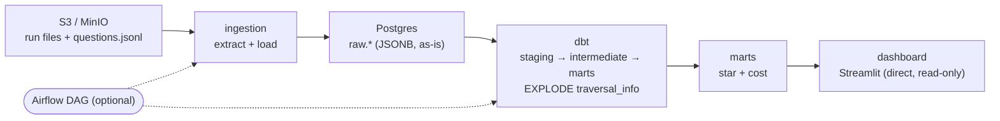
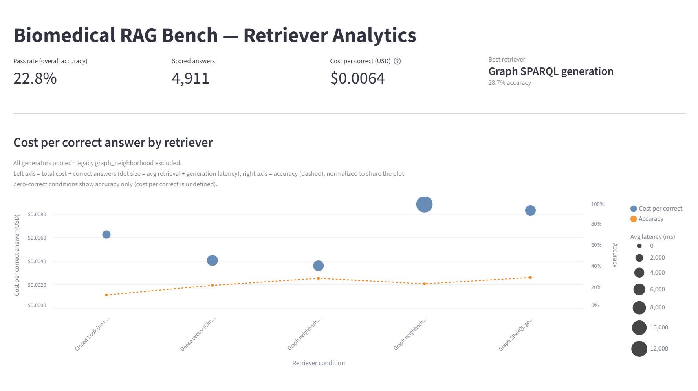
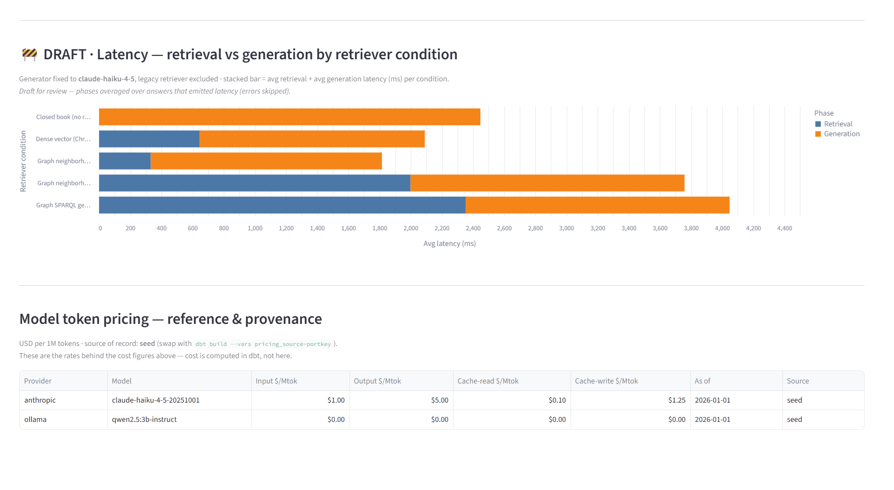
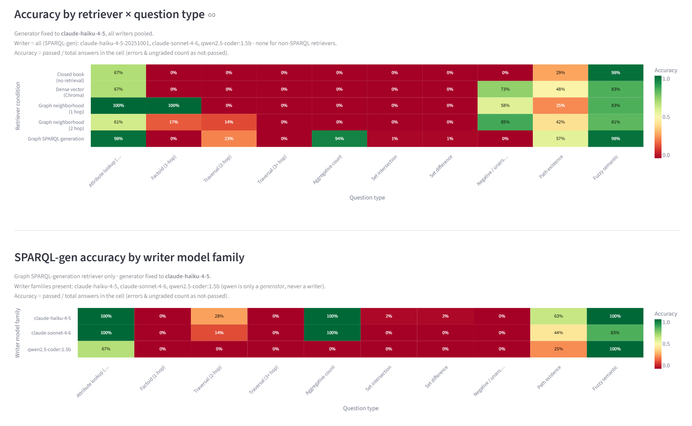
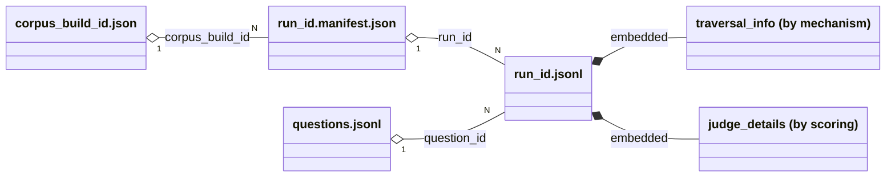
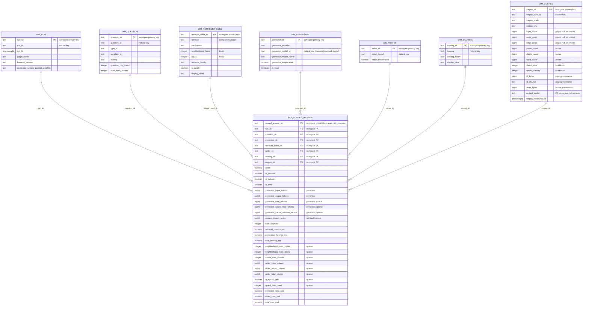
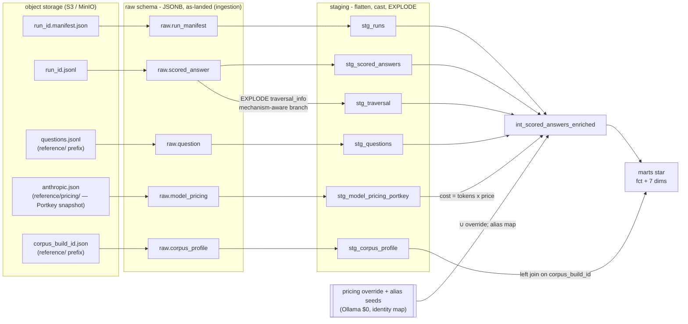

# rag-bench-analytics

The **analytics consumer** for [`biomedical-rag-bench`](../biomedical-rag-bench). The
benchmark *produces* evaluation results; this repo *turns accumulated results into a
dimensional model and a dashboard*.

> **Scope & coupling.** The pipeline machinery (extract/load, the star schema, dbt,
> serving) is domain-agnostic, but this repo is **purpose-built for `biomedical-rag-bench`**:
> it's bound to that benchmark's output *contract* (the run-file shape, `traversal_info`
> mechanisms) and ships seeds specific to it (retriever families, the hetionet/question
> taxonomy). It consumes those files from object storage and **never imports the benchmark's
> code** — the coupling is to the contract and the domain, not the internals.

The benchmark compares **retrievers** for biomedical question answering: the generator
LLM is fixed per run and ground truth comes from graph traversal (never an LLM), so the
**compared variable is the retriever** (closed-book / vector / graph-neighborhood /
graph-SPARQL-gen). This repo answers: *which retriever wins, at what cost, at what
latency, on which question types?*

## Architecture

<details open>
<summary><b>Image diagram</b></summary>


</details>

<details>
<summary><b>Mermaid diagram</b></summary>



</details>


- **Extract/Load** (`ingestion/`): pull run files from object storage, land them in a
  `raw` schema as JSONB, as-is. Idempotent, keyed by `run_id`. No transformation.
- **Transform** (`dbt/`): `staging → intermediate → marts`. The schema morph lives here.
- **Serve** (`dashboard/`): Streamlit reads the **marts schema directly** via a
  least-privilege read-only role (`marts_reader`) — never raw/staging, never as the
  warehouse owner. (Parquet→S3 for Streamlit Community Cloud is a documented, unbuilt
  fallback; see ADR-001.)
- **Orchestrate** (`airflow/`): a DAG runs the same chain. Optional — `make pipeline`
  runs it without Airflow.

## Dashboard Screenshot


 
 
 


## The source contract (what actually arrives)

The benchmark lands **one file pair per run**, a shared question bank, and a corpus profile
per build:

| File | Grain | Notes |
|---|---|---|
| `<run_id>.manifest.json` | one per run | generator, judge, corpus, timestamp |
| `<run_id>.jsonl` | one line per (run, question) | the scored answer + polymorphic `traversal_info` |
| `questions.jsonl` | shared | question type, hop-count, ground truth, template |
| `<corpus_build_id>.json` | one per corpus build | graph/vector size metrics; landed under the shared `reference/` prefix, joined to `dim_corpus` |

`traversal_info` is **schema-on-read**: its keys vary by retrieval mechanism (`dense`,
`neighborhood`, `sparqlgen`) and is empty `{}` on closed-book and older/error records.
The contract is **append-only and versioned** — the staging layer validates it and
tolerates unknown keys; it never assumes a frozen schema.

### Source contract, visualized

A containment diagram + field tables, with a *presence matrix* for the two polymorphic
objects (`traversal_info`, `judge_details`): which mechanism emits each key (`✓` / `·`)
plus a `→ star as` column for where it routes in the morph — expressing the schema-on-read
variance ER notation can't, without folding routing into per-attribute notes. Entity names
map to files: `RUN_MANIFEST` = `<run_id>.manifest.json`, `SCORED_ANSWER` =
`<run_id>.jsonl`, `QUESTION` = `questions.jsonl`, `CORPUS_PROFILE` =
`<corpus_build_id>.json`.

> **Authoritative contract:** the benchmark's `eval/README.md` + `retrievers/README.md`.
> The tables and matrix below are *this repo's read* of that contract for the morph (note
> the `→ star as` column) — a derived view, not the spec.



**`RUN_MANIFEST`** (`<run_id>.manifest.json`) — one per run

| field | type | notes |
|---|---|---|
| `run_id` | text | from filename |
| `timestamp` | text | ISO-8601 |
| `retriever` | text | the compared variable |
| `generator_provider` / `generator_model` | text | |
| `generator_model_resolved` | text | optional — resolved snapshot id |
| `generator_temperature` | numeric | optional |
| `judge` | text | e.g. `deterministic-v1` |
| `corpus_build_id` | text | optional |
| `harness_version`, `questions_path`, `num_questions`, `system_prompt_sha256` | text/bigint | |

**`QUESTION`** (`questions.jsonl`) — shared bank

| field | type | notes |
|---|---|---|
| `question_id` | text | PK |
| `type_id`, `template_id`, `question`, `scoring`, `answer_var` | text | |
| `ground_truth` | **array** | accepted answers — flattened to scalar in the row |
| `ground_truth_query` | text | the ground-truth `.rq` SPARQL |
| `seeds` | **array** | anchor entities; `[]` when none |
| `sampling_seed` | text | |

**`SCORED_ANSWER`** (`<run_id>.jsonl`) — one line per run × question; scalar fields

| field | type | notes |
|---|---|---|
| `run_id` / `question_id` | text | FKs |
| `type_id`, `question`, `predicted`, `retriever`, `scoring` | text | |
| `ground_truth` | text | **scalar** here (flattened from `QUESTION.ground_truth`) |
| `generator_provider` / `generator_model` | text | |
| `generator_model_resolved`, `generator_temperature` | text/numeric | optional |
| `score`, `passed`, `judged`, `verdict` | numeric/bool/text | |
| `error` | text | optional — present on error rows |
| `input_tokens`, `output_tokens`, `context_tokens_proxy`, `num_sources` | bigint | |
| `cache_read_input_tokens`, `cache_creation_input_tokens` | bigint | optional |
| `retrieval_latency_ms`, `generation_latency_ms` | numeric | |
| `traversal_info` | object | polymorphic by mechanism → matrix below |
| `judge_details` | object | polymorphic by scoring → note below |

**`traversal_info` presence matrix** — which mechanism populates each key, and where it
lands in the star. `✓` = emitted, `·` = absent.

| key | type | dense | neigh. | sparqlgen | closed_book | → star as |
|---|---|:-:|:-:|:-:|:-:|---|
| `mechanism` | text | ✓ | ✓ | ✓ | ✓ ¹ | dim attr |
| `context_tokenizer` | text | ✓ | ✓ | ✓ | ✓ | dropped |
| `retriever` | text | · | · | · | ✓ | dropped |
| `store` | text | ✓ | · | · | · | dropped |
| `collection` | text | ✓ | · | · | · | dropped |
| `embed_model` | text | ✓ | · | · | · | dropped |
| `top_k` | bigint | ✓ | · | · | · | measure |
| `num_chunks` | bigint | ✓ | · | · | · | measure |
| `cosine_distances` | array | ✓ | · | · | · | dropped |
| `pmids` | array | ✓ | · | · | · | dropped |
| `hops` | bigint | · | ✓ | · | · | measure |
| `max_per_predicate` | bigint | · | ✓ ² | · | · | dropped |
| `max_triples` | bigint | · | ✓ ² | · | · | dropped |
| `linked_entities` | object | · | ✓ | · | · | dropped |
| `num_linked` | bigint | · | ✓ | · | · | measure |
| `num_triples` | bigint | · | ✓ | · | · | measure |
| `endpoint` | text | · | ✓ | ✓ | · | dropped |
| `sparql` | array/text | · | ✓ ² | ✓ | · | dropped |
| `writer_model` | text | · | · | ✓ | · | dim attr / degen. |
| `writer_temperature` | numeric | · | · | ✓ | · | measure |
| `writer_input_tokens` | bigint | · | · | ✓ | · | measure |
| `writer_output_tokens` | bigint | · | · | ✓ | · | measure |
| `sparql_valid` | bool | · | · | ✓ | · | measure |
| `num_rows` | bigint | · | · | ✓ | · | measure |
| `sparql_generated` | text | · | · | ✓ | · | dropped |
| `writer_reply_raw` | text | · | · | ✓ | · | dropped |
| `sparql_error` | text | · | · | ✓ ³ | · | dropped |

¹ `closed_book` emits **no** `mechanism` today (`null.py`); staging backfills `none`. A
pending change request to the benchmark makes it universal at source.
² `neighborhood` success path only — the honest-miss path (no entity linked) omits these.
³ `sparqlgen` only when the generated query fails to execute.

**`judge_details`** is the same schema-on-read pattern, keyed by `scoring`: `string_match`
→ `{expected}`; `semantic` → `{expected, judge_model, judge_temperature, …}`. Kept in raw
provenance, dropped from the star — left opaque here by the same rule the `→ star as`
column applies to `traversal_info`.

**`CORPUS_PROFILE`** (`<corpus_build_id>.json`) — one per corpus build, referenced by the run
manifest's `corpus_build_id`. Enriches `dim_corpus` (ADR-004). Graph counts are **null on
smoke** (no endpoint serving it) — carried as null, never fabricated.

| field | type | → star as |
|---|---|---|
| `corpus_build_id` | text | `dim_corpus` natural key |
| `scale` | text | `corpus_scale` |
| `measured_at` | text | `corpus_measured_at` |
| `graph.triples` / `graph.nodes` / `graph.edges` | bigint | `triple_count` / `node_count` / `edge_count` (null on smoke) |
| `graph.ttl_bytes` / `graph.ttl_sha256` | bigint/text | `ttl_bytes` / `ttl_sha256` (provenance) |
| `vector.n_abstracts` / `n_chunks` / `n_words` | bigint | `paper_count` / `chunk_count` / `word_count` |
| `vector.chunk_size` / `chunk_overlap` / `store_bytes` | int/bigint | `chunk_size` / `chunk_overlap` / `store_bytes` |
| `vector.embed_model` | text | `embed_model` (FD on the corpus, not the retriever) |

```jsonc
// <run_id>.manifest.json
{ "run_id": "20260608T161819-vector-anthropic", "timestamp": "2026-06-08T16:20:28+0200",
  "retriever": "vector", "generator_provider": "anthropic", "generator_model": "claude-haiku-4-5",
  "judge": "deterministic-v1", "num_questions": 52, "harness_version": "harness-v1",
  "system_prompt_sha256": "96109672bcba1e4c" }   // resolved-id / temperature / corpus optional

// <run_id>.jsonl  (one line; graph_sparqlgen, abridged)
{ "question_id": "01_0hop_attribute__chromosome_of_gene__00", "scoring": "string_match",
  "ground_truth": "11", "retriever": "graph_sparqlgen", "predicted": "11",
  "score": 1.0, "passed": true, "verdict": "value '11' found in answer",
  "input_tokens": 176, "output_tokens": 5, "context_tokens_proxy": 3, "num_sources": 0,
  "retrieval_latency_ms": 2526.7, "generation_latency_ms": 1091.8,
  "traversal_info": { "mechanism": "sparqlgen", "writer_model": "claude-haiku-4-5-20251001",
    "writer_input_tokens": 568, "writer_output_tokens": 85, "sparql_valid": true,
    "num_rows": 1, "context_tokenizer": "wordpunct-v1" /* sparql*, writer_reply_raw elided */ },
  "judge_details": { "expected": "11" } }

// questions.jsonl  (one line)
{ "question_id": "10_fuzzy_semantic__…__00", "type_id": "10_fuzzy_semantic",
  "template_id": "anticoagulant_vitamin_k_antagonist_fuzzy", "scoring": "semantic",
  "answer_var": "compoundLabel", "ground_truth": ["Warfarin"], "seeds": [],
  "ground_truth_query": "PREFIX db: <…> SELECT ?compound ?compoundLabel WHERE { … }" }
```

## The star schema

Grain of the fact: **one scored answer = run × question × retriever condition.**

_The diagram mirrors the implemented marts — the dbt models and the `_marts.yml` contract
follow the ADR-003 field-naming convention._

**Seven** conformed dimensions around one fact. Every dimension join is a hashed **surrogate**
key (`*_sk`) computed from the *same* column list in fact and dim, so they join exactly —
uniform single-column joins even for the composite-key dims (`dim_generator`,
`dim_retriever_cond`). The fact carries the surrogate PK + surrogate FKs **only**;
natural/business keys live in their dimension and are never copied into the fact (ADR-003).
Every fact column is shown; the contract enforcing their types is
`dbt/models/marts/_marts.yml`. `sparse` marks columns null where a mechanism doesn't produce them.



- `fct_scored_answer` — surrogate PK + surrogate FKs to all dims + measures: `score`,
  `is_passed`, latencies, generator/writer token counts, the *exploded* realized mechanism
  measures (`neighborhood_num_triples`, `dense_num_chunks`, `writer_total_tokens`,
  `is_sparql_valid`, …), and **cost** (`generator_cost_usd`, `writer_cost_usd`,
  `total_cost_usd`). Sparse columns are expected (null where a mechanism doesn't produce
  them). Retriever *knobs* (`top_k`, `neighborhood_hops`) live on
  `dim_retriever_cond`, not the fact. The marts contract enforces column types — the dashboard binds to them.
- Seven dimensions: `dim_run`, `dim_question`, `dim_retriever_cond` (the compared variable),
  `dim_generator`, `dim_writer` (the SPARQL-writer LLM config), `dim_scoring`, `dim_corpus`.
- The **cost-per-token** prices come from an *external* source — the [Portkey-AI/models]
  (https://github.com/Portkey-AI/models) catalog, landed as a snapshot like any other input
  (`reference/pricing/<provider>.json` → `raw.model_pricing` → `stg_model_pricing_portkey`),
  refreshed out-of-band by `make refresh-pricing`. A small curated override supplies models
  Portkey structurally can't price (local Ollama = $0). Cost = tokens × price for both the
  answering LLM and the SPARQL-writer LLM; unpriced models yield NULL cost (never fabricated).

### The schema morph

The transform lives in staging. Note the fan-out: `raw.scored_answer` feeds **two** staging
models — the top-level flatten (`stg_scored_answers`) and the `traversal_info` explode
(`stg_traversal`) — which rejoin in intermediate alongside the flattened pricing snapshot:



The field-level routing:

| `run.json` field | Lands as |
|---|---|
| top-level ids (`run_id`, `question_id`, `retriever`, …) | dimension **surrogate** FKs (the ids stay in the dims) |
| `score` / `passed` / `latency` / realized counts | fact measures |
| exploded `traversal_info` realized numerics (`num_triples`, `num_chunks`, …) | fact measures (sparse) |
| retriever *knobs* (`top_k`, `hops`) | `dim_retriever_cond` attributes (grain) |
| `mechanism`, `writer_model` + `writer_temperature` | dim attributes (`dim_retriever_cond` / `dim_writer`) |
| `sparql` text, `sources`, `endpoint` | kept in raw provenance, **dropped from the star** |

## Quickstart (local, offline, no AWS)

```bash
make setup       # venv + deps + .env + dbt profile
make pipeline    # up (postgres+minio) → seed → ingest → dbt build
make dashboard   # Streamlit v1 at :8501, v2 at :8502 (direct-connect to marts)
```

`make pipeline` is the offline reproducibility check: `docker compose` + the committed
`ingestion_sample/` fixtures run the whole chain with no AWS account. Fixtures are
organized as dated **run batches** (`ingestion_sample/<batch>/`, discovered recursively)
plus a **`reference/`** dir holding the shared, non-run-scoped inputs (`questions.jsonl`
+ corpus profiles); see ADR-007.

Useful individual targets: `make up`, `make seed`, `make ingest`, `make dbt`,
`make test`, `make lint`, `make parse`, `make airflow`. Run `make help`.

## Local vs cloud

Same dbt models everywhere; only the **target** and **env vars** differ (never the model
code). Local uses Postgres + MinIO in `docker compose`; cloud uses RDS `t4g.micro` + real
S3, selected by `DBT_TARGET=cloud`. See `infra/` for the cheapest-viable AWS skeleton and
the cost discipline behind each component (notably: **no MWAA**, **no Aurora**).

## CI

`.github/workflows/ci.yml` runs the **same models** end-to-end on the fixtures against
ephemeral Postgres + MinIO service containers: lint → unit tests → seed → ingest →
`dbt build` (run + tests + contracts) → idempotency test. Fully offline, no AWS.

## Verification status

Validated in this repo: the ingestion logic against all **91 runs / 4,041 records / 2 corpus
profiles** of the real fixtures (including the empty-`traversal_info`, error-row, and
null-graph-count smoke edge cases), the unit suite, `ruff`, and `dbt parse`
(Jinja/refs/contracts). The full `dbt build` run
against Postgres + MinIO — plus the dashboard's direct read-only-role read of the marts
schema — is exercised by `make pipeline` and CI (both require Docker).

## Repo layout

```
ingestion/   EL: object storage -> raw Postgres (storage interface: local | s3)
dbt/         staging (flatten + EXPLODE) → intermediate (join + cost) → marts (star)
dashboard/   Streamlit (reads the marts schema directly, read-only role)
airflow/     optional orchestration DAG
infra/       cheapest-viable AWS (terraform)
tests/       pytest for ingestion
```
