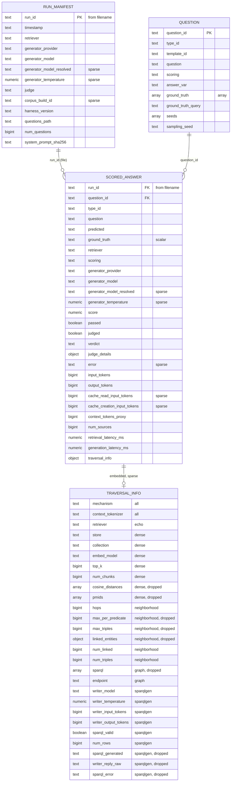
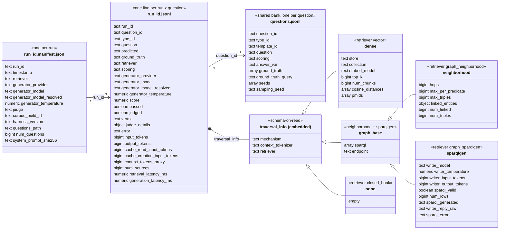
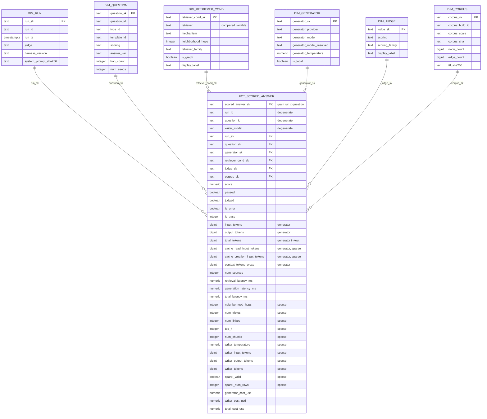
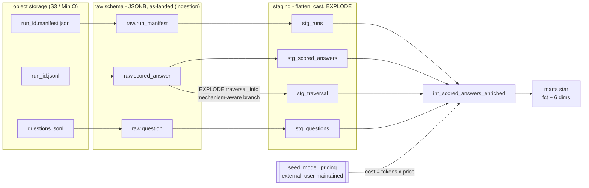

# rag-bench-analytics

The **analytics consumer** for [`biomedical-rag-bench`](../biomedical-rag-bench). The
benchmark *produces* evaluation results; this repo *turns accumulated results into a
dimensional model and a dashboard*.

> **Scope & coupling.** The pipeline machinery (extract/load, the star schema, dbt,
> serving) is domain-agnostic, but this repo is **purpose-built for `biomedical-rag-bench`**:
> it's bound to that benchmark's output *contract* (the run-file shape, `traversal_info`
> mechanisms) and ships seeds specific to it (retriever families, the hetionet/question
> taxonomy). It consumes those files from object storage and **never imports the benchmark's
> code** — the coupling is to the contract and the domain, not the internals.

The benchmark compares **retrievers** for biomedical question answering: the generator
LLM is fixed per run and ground truth comes from graph traversal (never an LLM), so the
**compared variable is the retriever** (closed-book / vector / graph-neighborhood /
graph-SPARQL-gen). This repo answers: *which retriever wins, at what cost, at what
latency, on which question types?*

## Architecture

```
S3 / MinIO            ingestion          Postgres (raw)        dbt                          marts          dashboard
run files       →   extract + load   →   raw.* (JSONB)    →  staging → intermediate → fct/dim   →   Parquet in S3 → Streamlit
 .jsonl  +                                                   (flatten, conform,           (star +        (reads marts
 .manifest.json                                              EXPLODE traversal_info)       cost)          only)
 questions.jsonl
                                  ── orchestrated by Airflow (optional) ──
```

- **Extract/Load** (`ingestion/`): pull run files from object storage, land them in a
  `raw` schema as JSONB, as-is. Idempotent, keyed by `run_id`. No transformation.
- **Transform** (`dbt/`): `staging → intermediate → marts`. The schema morph lives here.
- **Serve** (`serve/`, `dashboard/`): export marts to Parquet in S3; Streamlit reads the
  Parquet, never the warehouse.
- **Orchestrate** (`airflow/`): a DAG runs the same chain. Optional — `make pipeline`
  runs it without Airflow.

## The source contract (what actually arrives)

The benchmark lands **one file pair per run** plus a shared question bank:

| File | Grain | Notes |
|---|---|---|
| `<run_id>.manifest.json` | one per run | generator, judge, corpus, timestamp |
| `<run_id>.jsonl` | one line per (run, question) | the scored answer + polymorphic `traversal_info` |
| `questions.jsonl` | shared | question type, hop-count, ground truth, template |

`traversal_info` is **schema-on-read**: its keys vary by retrieval mechanism (`dense`,
`neighborhood`, `sparqlgen`) and is empty `{}` on closed-book and older/error records.
The contract is **append-only and versioned** — the staging layer validates it and
tolerates unknown keys; it never assumes a frozen schema.

### Source contract, visualized

Two renderings of the same three input files — kept side by side for now so we can pick
one. Entity names map to files: `RUN_MANIFEST` = `<run_id>.manifest.json`,
`SCORED_ANSWER` = `<run_id>.jsonl`, `QUESTION` = `questions.jsonl`.

**Option A — entity-relationship.** `traversal_info` is shown as one wide, sparse entity;
each attribute's note marks which `mechanism` populates it and flags the keys
`stg_traversal` drops (`dropped`). ER can't draw subtypes, so the polymorphism lives in
those notes:



**Option B — class / inheritance.** `traversal_info` is a base type specialized per
`mechanism`: `dense` and `none` extend it directly, while `neighborhood` and `sparqlgen`
share a `graph_base` subtype (both query a SPARQL `endpoint`). Closer to how the JSON
varies on disk (schema-on-read), at the cost of a busier diagram:



## The star schema

Grain of the fact: **one scored answer = run × question × retriever condition.**

Six conformed dimensions around one fact. FKs are hashed surrogate keys computed with the
*same* column lists in fact and dim, so they join exactly. Every fact column is shown; the
contract that enforces their types is `dbt/models/marts/_marts.yml`. `sparse` marks columns
that are null where a mechanism doesn't produce them.



- `fct_scored_answer` — FKs to all dims + measures: `score`, `passed`, latencies, token
  counts, the *exploded* traversal measures (`neighborhood_hops`, `writer_tokens`,
  `sparql_valid`, …), and **cost** (`generator_cost_usd`, `writer_cost_usd`,
  `total_cost_usd`). Sparse columns are expected (null where a mechanism doesn't produce
  them). The marts contract enforces column types — the dashboard binds to them.
- Dimensions: `dim_run`, `dim_question`, `dim_retriever_cond` (the compared variable),
  `dim_generator`, `dim_judge`, `dim_corpus`.
- The **cost-per-token** join is an *external* seed (`seed_model_pricing.csv`) — the
  prices are maintained here, not produced by the benchmark. Cost = tokens × price for
  both the answering LLM and the SPARQL-writer LLM; local (Ollama) models cost $0.

### The schema morph

The transform lives in staging. Note the fan-out: `raw.scored_answer` feeds **two** staging
models — the top-level flatten (`stg_scored_answers`) and the `traversal_info` explode
(`stg_traversal`) — which rejoin in intermediate alongside the external pricing seed:



The field-level routing:

| `run.json` field | Lands as |
|---|---|
| top-level ids (`run_id`, `question_id`, `retriever`, …) | dimension FKs |
| `score` / `passed` / `latency` / token counts | fact measures |
| exploded `traversal_info` numerics | fact measures (sparse) |
| `mechanism` / `writer_model` / `embed_model` | dim attributes / degenerate |
| `sparql` text, `sources`, `endpoint` | kept in raw provenance, **dropped from the star** |

## Quickstart (local, offline, no AWS)

```bash
make setup       # venv + deps + .env + dbt profile
make pipeline    # up (postgres+minio) → seed → ingest → dbt build → export
make dashboard   # Streamlit at http://localhost:8501
```

`make pipeline` is the offline reproducibility check: `docker compose` + the committed
`ingestion_sample/` fixtures run the whole chain with no AWS account.

Useful individual targets: `make up`, `make seed`, `make ingest`, `make dbt`,
`make export`, `make test`, `make lint`, `make parse`, `make airflow`. Run `make help`.

## Local vs cloud

Same dbt models everywhere; only the **target** and **env vars** differ (never the model
code). Local uses Postgres + MinIO in `docker compose`; cloud uses RDS `t4g.micro` + real
S3, selected by `DBT_TARGET=cloud`. See `infra/` for the cheapest-viable AWS skeleton and
the cost discipline behind each component (notably: **no MWAA**, **no Aurora**).

## CI

`.github/workflows/ci.yml` runs the **same models** end-to-end on the fixtures against
ephemeral Postgres + MinIO service containers: lint → unit tests → seed → ingest →
`dbt build` (run + tests + contracts) → idempotency test → export. Fully offline, no AWS.

## Verification status

Validated in this repo: the ingestion logic against all **81 runs / 3,461 records** of
the real fixtures (including the empty-`traversal_info` and error-row edge cases), the
unit suite, `ruff`, and `dbt parse` (Jinja/refs/contracts). The full `dbt build` + export
run against Postgres + MinIO is exercised by `make pipeline` and CI (both require Docker).

## Repo layout

```
ingestion/   EL: object storage -> raw Postgres (storage interface: local | s3)
dbt/         staging (flatten + EXPLODE) → intermediate (join + cost) → marts (star)
serve/       marts -> Parquet export
dashboard/   Streamlit (reads marts Parquet only)
airflow/     optional orchestration DAG
infra/       cheapest-viable AWS (terraform)
tests/       pytest for ingestion
```
